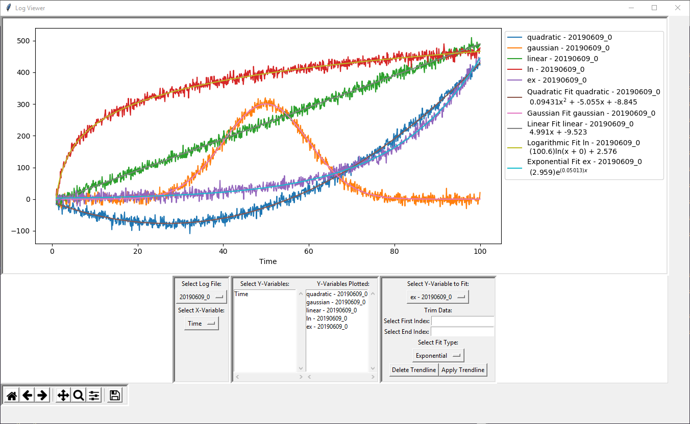
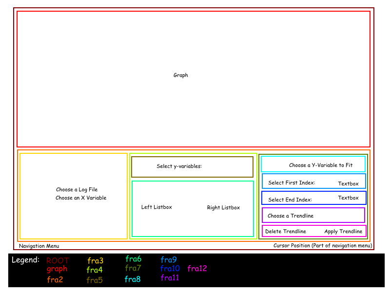

# Log-Viewer
GUI for displaying and fitting data obtained from logging system in LABVIEW for our bubble chamber.

Takes space delimited data with a header as seen in the sample log folder and allows for easy visualization and fitting of data. Any variable can be chosen as either the X or Y axis of the plot. Multiple variables can be plotted against the same X-axis, and each can have their own fitted lines. Data can also be loaded from multiple files to compare the same variables from different data sets! Each Y-data set is only allowed to be fit by one line at a time. The plot has real time tracking of the mouse and includes all other basic matplotlib functions such as zooming, scrolling, etc. This was written with Python 3 on a Windows machine, so I do not know how it functions elsewhere, but feel free to try it out!

## Future Plans
I've finished splitting the code up for readability, but I do not know if I have fixed all bugs. There is probably more room for additional functionality, so that may come as well.

## Sample output

## Tkinter Design
The tkinter design uses multiple embedded frames. In order to keep track of which is which, I made an image with a legend that describes which frame is where and what goes in it.

